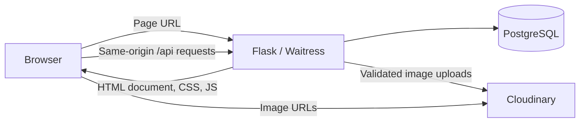

# Floréa Haven architecture

Floréa Haven sells seeds, flowers, and botanical perfumes. The storefront and administrator screens are standalone HTML documents with plain CSS and native JavaScript. Flask owns authentication, catalog changes, carts, purchasing, fulfillment, user management, and managed images. PostgreSQL stores the data.

## Request flow



Clicking a navigation link loads another HTML document. The page's JavaScript requests live data, updates labeled text or attributes, and clones row/dialog markup from native HTML templates. There is no React, JavaScript page renderer, client router, application bundle, or Tailwind compiler. Browser history supports back/forward navigation.

See [ADR 0005](docs/decisions/0005-plain-html-pages.md) and [the teammate guide](docs/teammate-guide.md) for the decision and page-by-page file map.

## Files and responsibilities

```text
client/
  index.html           Home document
  pages/               Catalog, product, auth, account, cart, checkout, orders
  admin/               Dashboard, catalog, categories, users, fulfillment
  css/styles.css       Ordinary CSS, responsive rules, animations, themes
  js/
    api.js             Same-origin fetch/XHR API methods and structured errors
    common.js          Session display, access redirects, navigation, theme, cart badge
    helpers.js         Native DOM operations, text filling, template cloning, focus
    catalog.js         Catalog data, filters, sorting, product availability
    auth.js            Login and registration submissions
    cart.js            Cart display, quantity changes, removal
    checkout.js        Delivery form, current-cart checks, checkout retries
    purchase.js        Buy-now dialog actions and direct checkout
    orders.js          Customer history/details and shared detail filling
    admin-*.js         Administrator forms, catalog, users, and fulfillment
    upload.js          File selection, preview, progress, upload/removal
  public/              Theme initialization and fallback image
  licenses/            Preserved CSS and SVG attribution
  dist/                Generated release copy
backend/
  florea/
    __init__.py        Flask factory, request policies, errors, static file serving
    frontend.py        Clean website URL → HTML document mapping
    auth.py            Cookie sessions, password hashing, authentication guards
    catalog.py         Public catalog and admin products/categories
    cart.py            Per-user carts and revision checks
    orders.py          Purchases, history, fulfillment, cancellation
    users.py           Administrator account management
    images.py          Managed upload/removal and durable cleanup
    db.py              PostgreSQL access and transactions
  migrations/          Existing ordered SQL migrations
  seeds/               Repeatable development catalog
  tests/               Integration, compatibility, and concurrency tests
  manage.py            Development/production serving and database commands
scripts/
  backend.mjs          Optional npm wrapper around Python commands
  build-frontend.mjs   Copy website files to client/dist; exclude unit tests
  e2e.py               Test server with an isolated PostgreSQL schema
```

Each HTML file contains its own header, footer, and drawer. Shared markup is deliberately repeated so a teammate can inspect the full screen in one file. IDs and `data-*` attributes connect elements to action handlers. API values are inserted with `textContent`; product/order data does not become executable markup. Native forms provide labels, named inputs, and browser validation.

## Development and production

`npm run dev` runs Flask at **http://localhost:4000**, serving editable files from `client/` and APIs from `/api`. Save and refresh to see edits. PostgreSQL must be running separately. There is no development proxy or frontend server.

`npm run build` copies HTML, CSS, JavaScript, licenses, and public assets into `client/dist`. No page markup is compiled. Production serves this directory through Flask/Waitress on the same HTTPS origin as the API. The production runtime requires Python, not Node. Unversioned website assets use `Cache-Control: no-cache` so the browser revalidates them after a deployment.

The Docker/Render setup also supports a private PostgreSQL database and shared rate limiting. See [the deployment runbook](docs/render-deployment.md) for migrations, secrets, backups, cleanup, and rollback. SQL migrations and established data remain unchanged by the HTML rewrite.

## Authentication and permissions

Login and registration call existing JSON endpoints. Flask hashes passwords with bcrypt and sets an HS256 JWT in an HTTP-only, same-site session cookie. Production adds the Secure attribute. The browser automatically sends the cookie with same-origin API requests; JavaScript does not store authentication tokens.

`common.js` calls `/api/auth/me`, updates account labels, and redirects visitors when a screen requires a member or administrator. These redirects are for the interface. Flask independently enforces authentication, ownership, roles, request origins, and rate limits on the APIs. Viewing an HTML document does not grant access to protected data.

Customers manage their own carts and orders. Administrators manage products, categories, accounts, stock, and fulfillment. Deactivation preserves history and revokes existing sessions. Backend rules block self-deactivation/demotion and losing the last administrator.

## Catalog and cart

The catalog requests `/api/categories` and `/api/products`; query strings carry category, search, price, sort, and page filters. Product rows are cloned from `product-card-template` and filled with live names, prices, images, and stock. Product-detail URLs use the same HTML document with a different API ID.

Cart mutations update persistent PostgreSQL records. The API returns the current cart and summary; the page updates row templates and the header count. Availability refreshes while pages are visible and after focus/reconnect. Checkout keeps delivery inputs in place while refreshing its item summary, so background checks do not replace the form being edited.

## Purchasing and fulfillment

Cart checkout rechecks availability and cart revision before sending the delivery address, payment method, and expected revision. Buy-now submits a selected product, quantity, and expected unit price without consuming the cart.

Both flows keep an idempotency key for retries of the same input. If a purchase succeeds but its response is lost, submitting unchanged input replays the original order. Changed input gets a new key. Stock/price conflicts show the server's error and require review of current data.

Flask purchases use database transactions, row locks, stock validation, immutable order-item snapshots, and rollback on failure. Historical names, SKUs, and prices remain unchanged when products are edited. The MVP accepts **Cash on Delivery**.

Order transitions are `pending → confirmed → preparing → shipped → delivered`. Only pending or confirmed orders can be cancelled. The API validates transitions and restores stock exactly once on cancellation. Customer endpoints enforce ownership; administrator endpoints provide fulfillment/customer details.

## Data and images

The main tables are `users`, `categories`, `products`, `cart_items`, `orders`, and `order_items`. Users own carts/orders; products belong to categories; orders have purchase-time item snapshots. Migration-ledger, session-revocation, cart-revision, idempotency, and image-cleanup records support the backend rules. Consult the SQL migrations and [API contract](docs/api-contract.md) for exact fields.

Uploads use authenticated multipart endpoints. Flask validates decoded bytes, declared type, dimensions, animation, and size; removes metadata; re-encodes to WebP; and uploads to Cloudinary with server-only credentials. PostgreSQL stores image metadata, not bytes. A durable cleanup queue handles abandoned/replaced assets. Upload failures retain the previous image. Native file inputs, previews, progress, and removal controls are defined in HTML.

## Verification

Vitest checks API transport, safe text/template operations, return paths, and themes. PostgreSQL tests cover permissions, compatibility, transactions, concurrent stock purchases, retries, uploads, and user management. Playwright checks customer/admin journeys, responsive layouts, themes, keyboard interactions, accessibility, and HTML availability before JavaScript runs.

Tests use isolated schemas and stub Cloudinary calls. Hosted HTTPS and real provider delivery need staging verification. See [the migration record](docs/frontend-migration.md) and [release status](docs/release-status.md).
